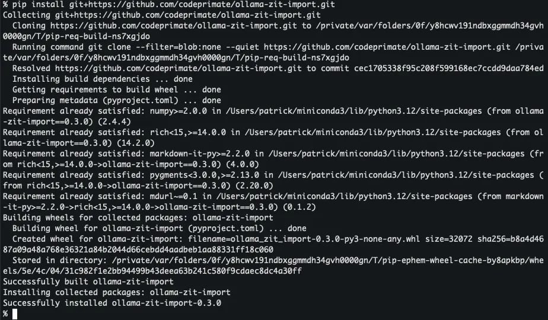
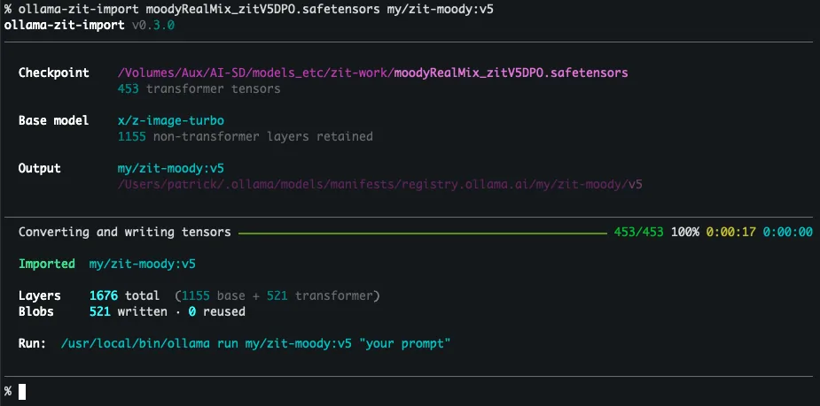
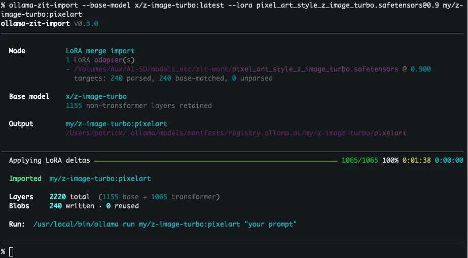
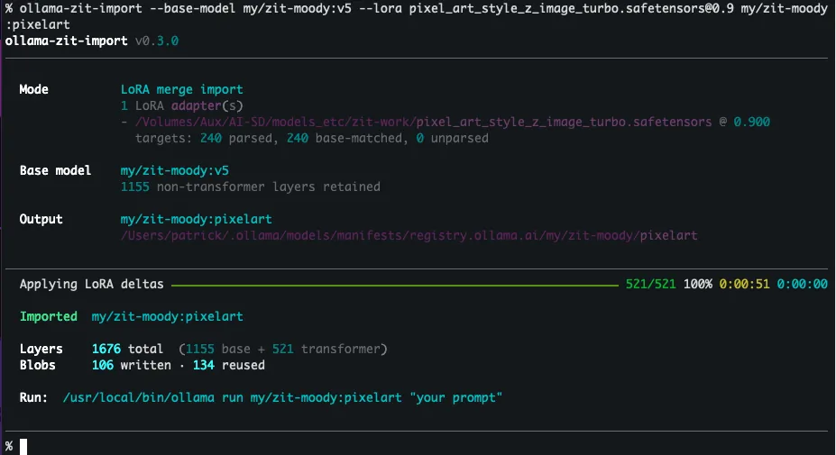

# ollama-zit-import

`ollama-zit-import` creates local Ollama models from z-image-turbo model files. It can
import a full `.safetensors` checkpoint, or it can apply one or more LoRA adapters to an
existing base model and save the result as a new model.

The end result is a named Ollama model, such as `my/imported-zit-model`,
`my/imported-zit-model:v1`, or `my/imported-zit-model:style-a`, that is available from
your normal Ollama install.

## What It Does

The importer supports two common workflows.

**Full checkpoint import** takes a z-image-turbo `.safetensors` checkpoint and creates a new
Ollama model from it.

**LoRA merge import** starts from a base model, applies one or more LoRA adapters, and
saves the result as a separate model. The base model is left in place.

You can also combine these workflows. Import a custom full checkpoint first, then use
that imported model as the base for LoRA merge models with tags such as `:style-a` or
`:experiment-v1`.

## Quick Start

Install:

```bash
python3 -m pip install git+https://github.com/codeprimate/ollama-zit-import.git
```

Import a bf16 or fp16 checkpoint:

```bash
ollama-zit-import /path/to/model.safetensors imported-zit-model
ollama run my/imported-zit-model
```

Merge LoRAs into a new model:

```bash
ollama-zit-import my/zit-style-a:latest \
  --base-model x/z-image-turbo:latest \
  --lora /path/style_a.safetensors@0.6
ollama run my/zit-style-a
```

See [Installation](#installation) and [Typical Usage](#typical-usage) for clones, options, and detail.

## Choosing Inputs

When downloading files from model-sharing sites, look for models that are explicitly made
for `z-image-turbo` or describe themselves as z-image-turbo fine-tunes.

For a full checkpoint import, choose a `.safetensors` file for the full model. These are
usually listed as checkpoints, fine-tunes, or full model weights. Avoid files that are
only labeled as LoRA, embedding, VAE, text encoder, or workflow metadata.

Use full-precision checkpoint weights for direct imports. On download pages, these are
commonly labeled `BF16`, `FP16`/`F16`, or `FP32`/`F32`. Do not use `GGUF`, `EXL2`,
`GPTQ`, `AWQ`, `Q4`, `Q5`, `Q8`, or other quantized download formats as the input
checkpoint.

For LoRA merging, choose LoRA adapter files that list z-image-turbo as their base or
recommended model. LoRAs made for another base model may import poorly, fail validation,
or produce unexpected output.

LoRA files should also be normal `.safetensors` adapters. The Ollama base model may
already be quantized; the importer handles the quantized base when merging the adapters
into the new model.

In both cases, prefer downloads that mention ComfyUI, Diffusers, or z-image-turbo support.
Arbitrary diffusion checkpoints are not expected to work.

## Prerequisites

You need:

- Python 3.12 or newer.
- Ollama installed and available on `PATH`, or passed with `--ollama-bin`.
- An initialized Ollama models directory.
- A z-image-turbo checkpoint, LoRA adapter, or base model.

`ollama-zit-import` is known to work with Ollama `v0.22.0`. Future Ollama updates may
introduce breaking changes. If you hit a compatibility issue, please open a bug report
at [GitHub issues](https://github.com/codeprimate/ollama-zit-import/issues).

By default, Ollama stores models in `$OLLAMA_MODELS` if set, otherwise
`~/.ollama/models`. You can point the importer somewhere else with `--ollama-models`.

## Installation

```bash
python3 -m pip install git+https://github.com/codeprimate/ollama-zit-import.git
```

Optional local install from a clone:

```bash
git clone https://github.com/codeprimate/ollama-zit-import.git
cd ollama-zit-import
make install
```

After installation, use the `ollama-zit-import` command.

## Typical Usage

Start with `--dry-run`. It checks the input, confirms the destination model name, reports
what will happen, and exits without creating the model.

### Model Names And Versions

Output model names use Ollama-style references. A short name such as
`imported-zit-model` is expanded to `my/imported-zit-model:latest`. A namespaced model
without a tag, such as `my/imported-zit-model`, also uses `latest`.

You can also provide the namespace and optional version tag yourself:

- `my/imported-zit-model`
- `my/imported-zit-model:v1`
- `my/imported-zit-model:style-a`

The tag after `:` is optional. It is useful when you want to keep multiple versions, such
as `:v1`, or when you want the tag to describe a merged LoRA, such as `:style-a`.

### Import A Full Checkpoint

Preview the import:

```bash
ollama-zit-import /path/to/model.safetensors imported-zit-model --dry-run
```

Create the model:

```bash
ollama-zit-import /path/to/model.safetensors imported-zit-model
```

Run it with Ollama:

```bash
ollama run my/imported-zit-model
```

You can also provide a full model name with an explicit version tag:

```bash
ollama-zit-import /path/to/model.safetensors my/imported-zit-model:v1
```

### Merge LoRA Adapters Into A New Model

Use LoRA mode when you have adapters and want a new model based on an existing one. The
base model is required. Each adapter is written as `PATH@WEIGHT`.

Start with the default z-image-turbo base model when the LoRA was made for that base.

Preview the result:

```bash
ollama-zit-import my/zit-style-a:latest \
  --base-model x/z-image-turbo:latest \
  --lora /path/style_a.safetensors@0.6 \
  --lora /path/style_b.safetensors@0.35 \
  --dry-run
```

Create the model:

```bash
ollama-zit-import my/zit-style-a:latest \
  --base-model x/z-image-turbo:latest \
  --lora /path/style_a.safetensors@0.6 \
  --lora /path/style_b.safetensors@0.35
```

Run it:

```bash
ollama run my/zit-style-a
```

You can also use a custom model you imported earlier as the base. For example, import a
checkpoint as `my/imported-zit-model:v1`, then create LoRA merge variants from it:

```bash
ollama-zit-import my/imported-zit-model:style-a \
  --base-model my/imported-zit-model:v1 \
  --lora /path/style_a.safetensors@0.6
```

LoRA weights must be between `0.1` and `1.0`, inclusive. You can pass `--lora` more than
once to combine multiple adapters.

### Use A Non-Default Ollama Store

Use `--ollama-models` when your models live outside the default location:

```bash
ollama-zit-import /path/to/model.safetensors my/imported-zit-model:latest \
  --ollama-models /path/to/ollama/models
```

Use `--ollama-bin` when the Ollama executable is not on `PATH`:

```bash
ollama-zit-import /path/to/model.safetensors my/imported-zit-model:latest \
  --ollama-bin /Applications/Ollama.app/Contents/Resources/ollama
```

## What To Expect

The output model name must be new. If a model already exists at that name, the command
stops instead of overwriting it.

If the selected base model is missing, the importer attempts to pull it with Ollama.

Dry-run output is especially useful for LoRA imports. It reports how many adapter keys
match the base model, which helps catch incompatible adapters before you create anything.

Model imports and LoRA merges usually finish in less than a minute on a Mac M2 Max.

Behind the scenes, the tool writes the files Ollama needs in its model store. It reuses
existing data when possible and creates a new model entry for the requested output name.

For deeper implementation details, see [`technical.md`](technical.md).

## Demo

Terminal walkthrough and example images from this repository.

### Screenshots

**Installing the CLI with `pip` from the GitHub repository.**


**Importing a full `.safetensors` checkpoint into a new Ollama model.**


**LoRA merge import using `--base-model` and `--lora` against `my/zit-moody:v5`.**


**LoRA merge when the base model is a custom checkpoint you imported earlier.**


### Sample outputs

Each image used the `ollama run` command in the matching file under [`docs/samples/`](docs/samples/).


## Contributing

Contributions are welcome.

- Open bugs and feature requests in [GitHub issues](https://github.com/codeprimate/ollama-zit-import/issues).
- Send pull requests for fixes and improvements.
- For local development, use `make dev-install`.
- Before opening a pull request, run `make check`.

## Developer Workflow

Clone the repository:

```bash
git clone https://github.com/codeprimate/ollama-zit-import.git
cd ollama-zit-import
```

Install `uv` first if needed:

```bash
brew install uv
```

Sync dependencies into the project environment:

```bash
uv sync --extra dev
```

Use the developer install when working on the project:

```bash
make dev-install
```

This installs the package in editable mode with development dependencies into
the existing `.venv` using `uv`.

Useful development commands:

- `make lint`: run `ruff`.
- `make format`: run `black --check`.
- `make typecheck`: run `mypy`.
- `make test`: run `pytest`.
- `make check`: run linting, format check, type checking, and tests.
- `make run-help`: verify the module entry point and help output.
- `make dry-run-example`: print the standard dry-run command template.

The `Makefile` routes tooling through `uv` in the project environment.

If you run commands directly, prefer:

- `uv run ...`

The package entry points are:

- `ollama-zit-import`, installed from `pyproject.toml`.
- `python3 -m ollama_zit_import`, useful from a source checkout.

The main implementation lives under `src/ollama_zit_import/`. Tests live under `tests/`.
